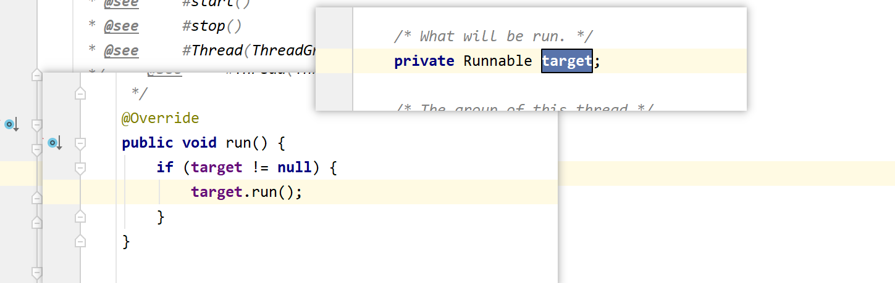
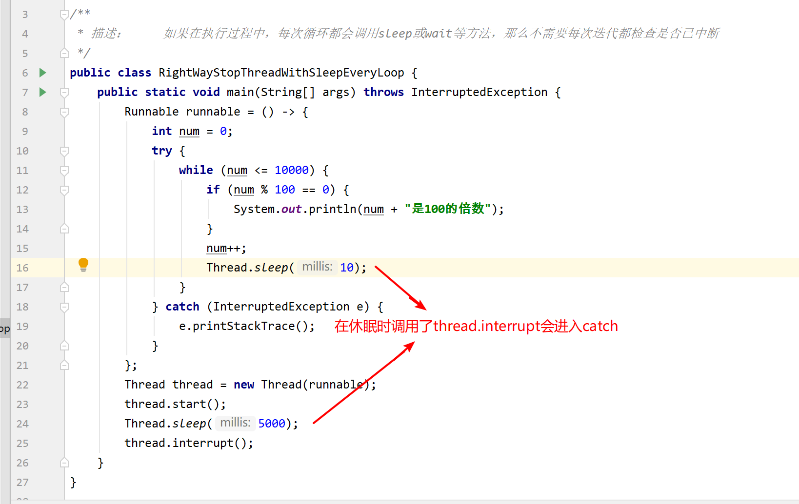
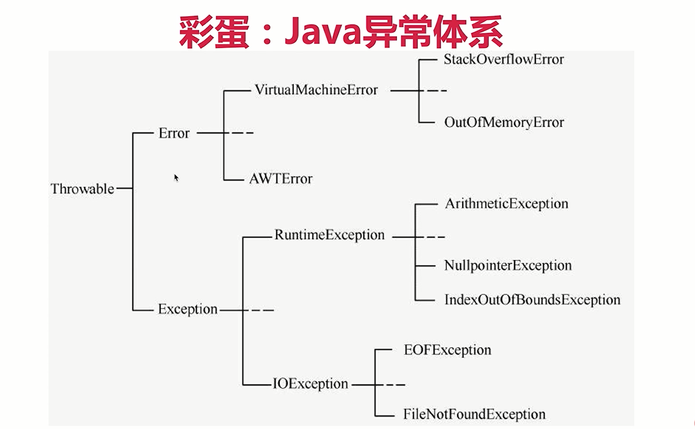
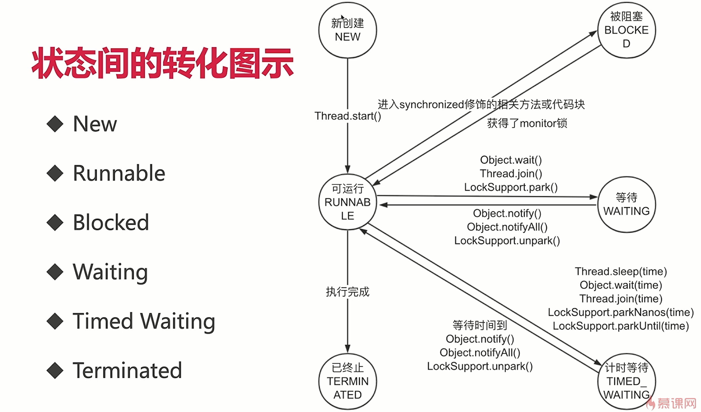
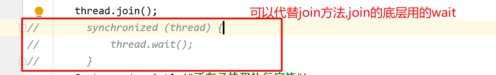
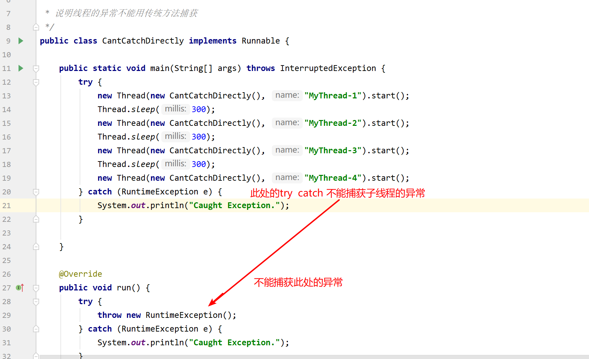
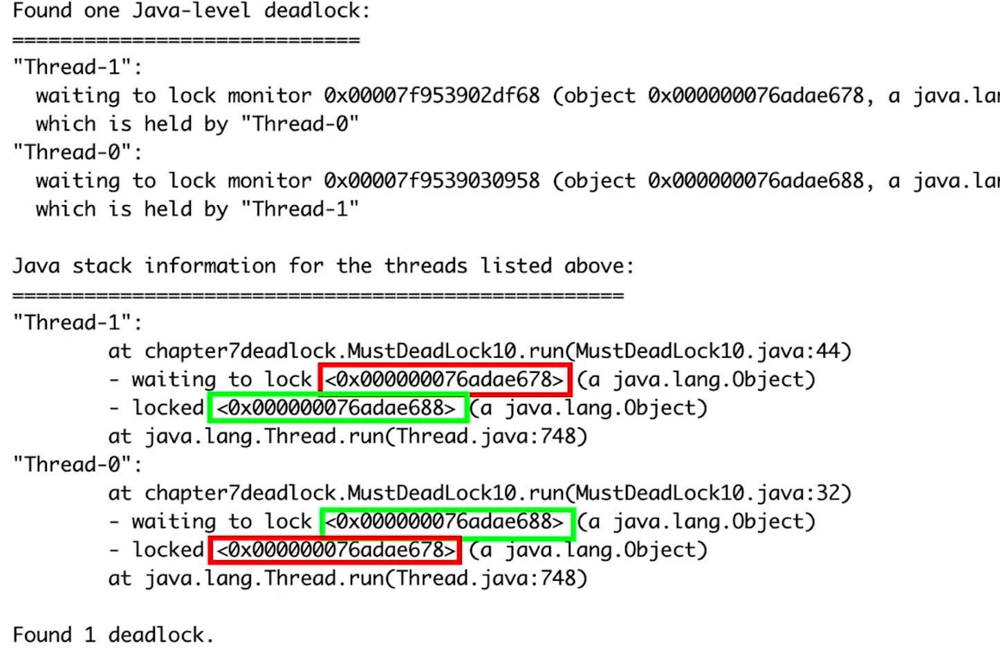
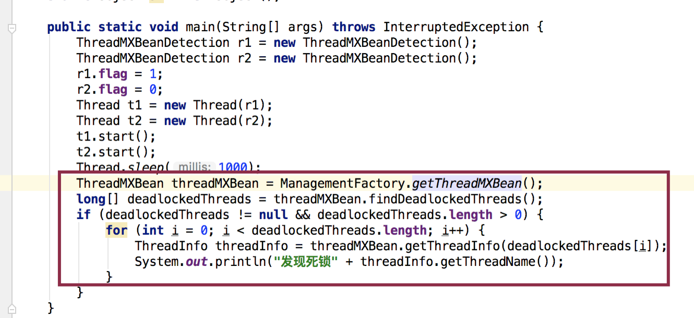
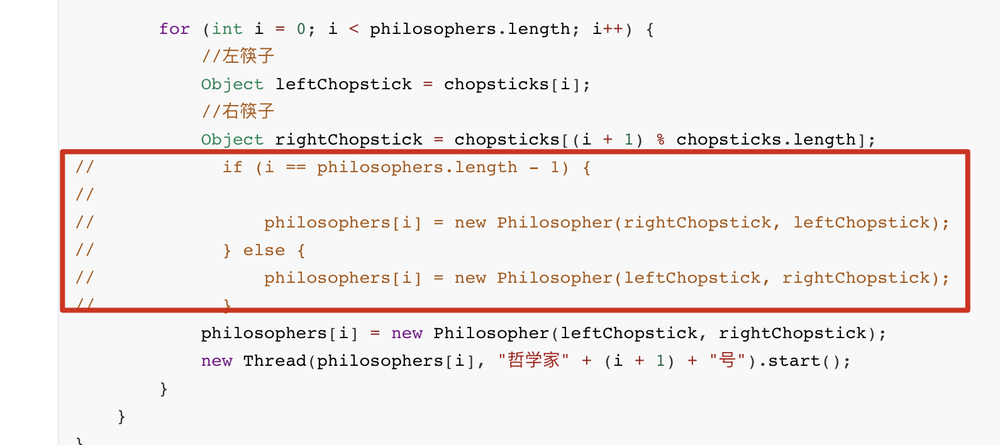

## 3-1 迷雾重重——实现多线程的方法到底是几种？


## 3-2 无独有偶——同时使用两种方法；正确实现方法的总结


## 3-7 眼前一亮——实现多线程常见面试问题

### 有多少中实现线程的方式：

Oracle官网上写的是两种，分别是继承Thread类重写run方法和实现Runnable接口的run方法然后再把Runnable实例传给Thread类。

本质上只有一种，这两种都是最终调用了start()方法来新建线程。他们的区别在于run()方法的内容来源：

实现Runnable接口：最终调用的是target.run()    :把Runnable传到Thred中再调用Runnable的run方法



继承Thread类run()被重写

还有其他实现线程的方法，例如线程池等，他们也可以新建线程，但是看源码，也都是实现Runnable接口和继承Thread类。

### 实现Runnable接口和继承Thread类那种更好？

实现Runnable的方式更好：

从代码架构考虑，实现Runnable接口程序是解耦的；

java是单继承多实现的，继承了Thread就不能继承其他类了；

继承Thread类每次都创建一个独立的线程，消耗了资源。而实现Runnable接口可以使用线程池等工具；

## 4-5 启动线程——常见面试问题


会报异常，start()会对线程状态进行检查，如果已经执行了start()方法就会抛出异常。

直接调用run()只是一个普通的方法调用不会开辟新线程，start()会开启新的线程，经历线程的生命周期


```
使用Thread.currentThread().isInterrupted()检查有没有使用thread.interrupt()，如果使用了就做相应的处理
```

当线程在休眠状态时Thread.sleep(),调用了thread.interrupt()方法会抛异常;

interrupt好处：被中断的线程拥有响应中断的权利




## 5-9 不速之客——彩蛋：【Java异常体系】



Error:java运行时系统的内部错误

RuntimeException: 通过捕获可以恢复的，写程序时应该避免的，如：索引越界、空指针异常等

## 5-14 明辨是非——练习：判断interrupt状态的方法辨析

```java
package threadcoreknowledge.stopthreads;

/**
 * 描述：     注意Thread.interrupted()方法的目标对象是“当前线程”，而不管本方法来自于哪个对象
 */
public class RightWayInterrupted {

    public static void main(String[] args) throws InterruptedException {

        Thread threadOne = new Thread(new Runnable() {
            @Override
            public void run() {
                for (; ; ) {
                }
            }
        });

        // 启动线程
        threadOne.start();
        //设置中断标志
        threadOne.interrupt();
        //获取中断标志
        System.out.println("isInterrupted: " + threadOne.isInterrupted());//threadOne线程设置中断标志  返回   true
        //获取中断标志并重置
        System.out.println("isInterrupted: " + threadOne.interrupted());//这个是判断自己当前所在的线程（主线程）有没有被中断返回 false
        //获取中断标志并重直
        System.out.println("isInterrupted: " + Thread.interrupted());//这个时判断主线程有没有被中断返回 false
        //获取中断标志
        System.out.println("isInterrupted: " + threadOne.isInterrupted());//threadOne线程设置中断标志  返回   true
        threadOne.join();
        System.out.println("Main thread is over.");
    }
}
```

## 5-15 停止线程——常见面试问题


## 6-2 一图千言——六个状态的含义和转化路径




## 7-8 面试问题——wait相关高频面试题


### 用程序实现两个线程交替打印0-100的奇偶数

```java
package threadcoreknowledge.threadobjectclasscommonmethods;


/**
 * 描述：     两个线程交替打印0~100的奇偶数，用wait和notify
 */
public class WaitNotifyPrintOddEveWait {

    private static int count = 0;
    private static final Object lock = new Object();


    public static void main(String[] args) {
        new Thread(new TurningRunner(), "偶数").start();
        new Thread(new TurningRunner(), "奇数").start();
    }

    //1. 拿到锁，我们就打印
    //2. 打印完，唤醒其他线程，自己就休眠
    static class TurningRunner implements Runnable {

        @Override
        public void run() {
            while (count <= 100) {
                synchronized (lock) {
                    //拿到锁就打印
                    System.out.println(Thread.currentThread().getName() + ":" + count++);
                    lock.notify();
                    if (count <= 100) {
                        try {
                            //如果任务还没结束，就让出当前的锁，并休眠
                            lock.wait();
                        } catch (InterruptedException e) {
                            e.printStackTrace();
                        }
                    }
                }
            }
        }
    }
}
```


## 7-11 阳春白雪——sleep响应中断、优雅写法、一句话总结、面试问题

### 优雅写法

```java
                TimeUnit.HOURS.sleep(3);
                TimeUnit.MINUTES.sleep(25);
                TimeUnit.SECONDS.sleep(1);
```

### 讲一讲sleep方法的特点


### wait和sleep方法的异同

相同：

1.wait和sleep方法都可以使线程阻塞，进入等待状态

2.wait和sleep方法都可以响应中断Thread.interrupt();

不同：

1.wait方法的执行必须在同步方法中，而sleep则不需要

为什么wait()必须在同步方法中：wait方法在同步方法中线程更安全，防止死锁和永久等待

2.在同步方法里执行sleep方法时，不会释放monitor锁，但是wait方法会释放monitor锁

3.sleep方法短暂休眠之后会主动退出阻塞，而没有指定时间的wait方法则需要被其他线程中断后才能退出阻塞

4.wait()和notify(),notifyAll()是Object类的方法，sleep()和yieId()是Thread类的方法

为什么 wait()是Object类： java每一个类都是一把锁

## 7-14 孪生兄弟——join注意点、原理、源码分析、替代写法、面试问题





## 8-3 守护天使——线程名字、守护线程


### 守护线程和普通线程的区别：

区别在于是否会影响JVM的退出，以及作用不同。普通线程是执行业务逻辑的，而守护线程是服务普通线程的

### 我们是否需要给线程设置为守护线程？

jVM自身提供的守护线程就够我们用了。不应该把自己的线程为设置守护线程，这样很危险。jvm会自动关闭守护线程。

## 8-4 上上之选——线程优先级、4个属性总结、线程属性面试问题


## 9-3 线程异常——自己实现并处理异常；常见面试问题




## 10-6 互不相让——死锁发生

### 演示死锁：

```java
package background;

/**
 * 描述：     第二章线程安全问题，演示死锁。
 */
public class MultiThreadError implements Runnable {

    int flag = 1;
    static Object o1 = new Object();
    static Object o2 = new Object();

    public static void main(String[] args) {
        MultiThreadError r1 = new MultiThreadError();
        MultiThreadError r2 = new MultiThreadError();
        r1.flag = 1;
        r2.flag = 0;
        new Thread(r1).start();
        new Thread(r2).start();
    }

    @Override
    public void run() {
        System.out.println("flag = " + flag);
        if (flag == 1) {
            synchronized (o1) {
                try {
                    Thread.sleep(500);
                } catch (InterruptedException e) {
                    e.printStackTrace();
                }
                synchronized (o2) {
                    System.out.println("1");
                }
            }
        }
        if (flag == 0) {
            synchronized (o2) {
                try {
                    Thread.sleep(500);
                } catch (InterruptedException e) {
                    e.printStackTrace();
                }
                synchronized (o1) {
                    System.out.println("0");
                }
            }
        }
    }
}
```


## 10-7 逃出生天——逸出private对象的后果

### 方法返回一个private对象

我们不想private对象被修改，但是返回private对象其他用户就可以修改他了。解决办法在10-11中有讲解

```java
package background;

import com.sun.javafx.geom.Matrix3f;
import java.util.HashMap;
import java.util.Map;

/**
 * 描述：  发布逸出
 */
public class MultiThreadsError3 {

    private Map<String, String> states;

    public MultiThreadsError3() {
        states = new HashMap<>();
        states.put("1", "周一");
        states.put("2", "周二");
        states.put("3", "周三");
        states.put("4", "周四");
    }

    public Map<String, String> getStates() {
        return states;
    }

    public static void main(String[] args) {
        MultiThreadsError3 multiThreadsError3 = new MultiThreadsError3();
        Map<String, String> states = multiThreadsError3.getStates();
       System.out.println(states.get("1"));
       states.remove("1");
       System.out.println(states.get("1"));   

    }
}
```


## 10-8 你中有我—— 初始化未完毕，就this赋值

```java
package background;

/**
 * 描述：     初始化未完毕，就this赋值
 */
public class MultiThreadsError4 {

    static Point point;

    public static void main(String[] args) throws InterruptedException {
        new PointMaker().start();
//        Thread.sleep(10);
        Thread.sleep(105);
        if (point != null) {
            System.out.println(point);
        }
    }
}

class Point {

    private final int x, y;

    public Point(int x, int y) throws InterruptedException {
        this.x = x;
        MultiThreadsError4.point = this;
        Thread.sleep(100);
        this.y = y;
    }

    @Override
    public String toString() {
        return x + "," + y;
    }
}

class PointMaker extends Thread {

    @Override
    public void run() {
        try {
            new Point(1, 1);
        } catch (InterruptedException e) {
            e.printStackTrace();
        }
    }
}
```

## 10-9 心急火燎——隐藏的风险：注册监听器

```java
package background;

/**
 * 描述：     
 */
public class MultiThreadsError5 {

    int count;

    public MultiThreadsError5(MySource source) {
        source.registerListener(new EventListener() {
            @Override
            public void onEvent(Event e) {
                System.out.println("\n我得到的数字是" + count);
            }

        });
        for (int i = 0; i < 10000; i++) {
            System.out.print(i);
        }
        count = 100;
    }

    public static void main(String[] args) {
        MySource mySource = new MySource();
        new Thread(new Runnable() {
            @Override
            public void run() {
                try {
                    Thread.sleep(10);
                } catch (InterruptedException e) {
                    e.printStackTrace();
                }
                mySource.eventCome(new Event() {
                });
            }
        }).start();
        MultiThreadsError5 multiThreadsError5 = new MultiThreadsError5(mySource);
    }

    static class MySource {

        private EventListener listener;

        void registerListener(EventListener eventListener) {
            this.listener = eventListener;
        }

        void eventCome(Event e) {
            if (listener != null) {
                listener.onEvent(e);
            } else {
                System.out.println("还未初始化完毕");
            }
        }

    }

    interface EventListener {

        void onEvent(Event e);
    }

    interface Event {

    }
}
```

## 10-10 时不我待——构造函数中新建线程

```Java
package background;

import java.util.HashMap;
import java.util.Map;

/**
 * 描述：     构造函数中新建线程
 */
public class MultiThreadsError6 {

    private Map<String, String> states;

    public MultiThreadsError6() {
        new Thread(new Runnable() {
            @Override
            public void run() {
                states = new HashMap<>();
                states.put("1", "周一");
                states.put("2", "周二");
                states.put("3", "周三");
                states.put("4", "周四");
            }
        }).start();
    }

    public Map<String, String> getStates() {
        return states;
    }

    public static void main(String[] args) throws InterruptedException {
        MultiThreadsError6 multiThreadsError6 = new MultiThreadsError6();
        Thread.sleep(1000);
        System.out.println(multiThreadsError6.getStates().get("1"));
    }
}
```

## 10-11 狸猫太子——用“副本”代替“真身”

```java
package background;

import com.sun.javafx.geom.Matrix3f;
import java.util.HashMap;
import java.util.Map;

/**
 * 描述：     发布逸出
 */
public class MultiThreadsError3 {

    private Map<String, String> states;

    public MultiThreadsError3() {
        states = new HashMap<>();
        states.put("1", "周一");
        states.put("2", "周二");
        states.put("3", "周三");
        states.put("4", "周四");
    }

    public Map<String, String> getStates() {
        return states;
    }

    public Map<String, String> getStatesImproved() {
        return new HashMap<>(states);
    }

    public static void main(String[] args) {
        MultiThreadsError3 multiThreadsError3 = new MultiThreadsError3();
        Map<String, String> states = multiThreadsError3.getStates();
//        System.out.println(states.get("1"));
//        states.remove("1");
//        System.out.println(states.get("1"));

        System.out.println(multiThreadsError3.getStatesImproved().get("1"));
        multiThreadsError3.getStatesImproved().remove("1");
        System.out.println(multiThreadsError3.getStatesImproved().get("1"));

    }
}
```

## 10-12 工厂模式——解决逸出的妙用

```java
package background;


/**
 * 描述：     用工厂模式修复刚才的初始化问题
 */
public class MultiThreadsError7 {

    int count;
    private EventListener listener;

    private MultiThreadsError7(MySource source) {
        listener = new EventListener() {
            @Override
            public void onEvent(MultiThreadsError5.Event e) {
                System.out.println("\n我得到的数字是" + count);
            }

        };
        for (int i = 0; i < 10000; i++) {
            System.out.print(i);
        }
        count = 100;
    }

    public static MultiThreadsError7 getInstance(MySource source) {
        MultiThreadsError7 safeListener = new MultiThreadsError7(source);
        source.registerListener(safeListener.listener);
        return safeListener;
    }

    public static void main(String[] args) {
        MySource mySource = new MySource();
        new Thread(new Runnable() {
            @Override
            public void run() {
                try {
                    Thread.sleep(10);
                } catch (InterruptedException e) {
                    e.printStackTrace();
                }
                mySource.eventCome(new MultiThreadsError5.Event() {
                });
            }
        }).start();
        MultiThreadsError7 multiThreadsError7 = new MultiThreadsError7(mySource);
    }

    static class MySource {

        private EventListener listener;

        void registerListener(EventListener eventListener) {
            this.listener = eventListener;
        }

        void eventCome(MultiThreadsError5.Event e) {
            if (listener != null) {
                listener.onEvent(e);
            } else {
                System.out.println("还未初始化完毕");
            }
        }

    }

    interface EventListener {

        void onEvent(MultiThreadsError5.Event e);
    }

    interface Event {

    }
}
```

## 10-13 面面俱到——四种需要考虑线程安全的情况


## 14-3 一图千言——什么是死锁？


## 14-5 冤家路窄——必然发生死锁的例子

```java
package deadlock;


/**
 * 描述：     必定发生死锁的情况
 */
public class MustDeadLock implements Runnable {

    int flag = 1;

    static Object o1 = new Object();
    static Object o2 = new Object();

    public static void main(String[] args) {
        MustDeadLock r1 = new MustDeadLock();
        MustDeadLock r2 = new MustDeadLock();
        r1.flag = 1;
        r2.flag = 0;
        Thread t1 = new Thread(r1);
        Thread t2 = new Thread(r2);
        t1.start();
        t2.start();
    }

    @Override
    public void run() {
        System.out.println("flag = " + flag);
        if (flag == 1) {
            synchronized (o1) {
                try {
                    Thread.sleep(500);
                } catch (InterruptedException e) {
                    e.printStackTrace();
                }
                synchronized (o2) {
                    System.out.println("线程1成功拿到两把锁");
                }
            }
        }
        if (flag == 0) {
            synchronized (o2) {
                try {
                    Thread.sleep(500);
                } catch (InterruptedException e) {
                    e.printStackTrace();
                }
                synchronized (o1) {
                    System.out.println("线程2成功拿到两把锁");
                }
            }
        }
    }
}
```

## 14-6 互不相让——银行转账发生死锁

```java
package deadlock;

/**
 * 描述：     转账时候遇到死锁，一旦打开注释，便会发生死锁
 */
public class TransferMoney implements Runnable {

    int flag = 1;
    static Account a = new Account(500);
    static Account b = new Account(500);
    static Object lock = new Object();

    public static void main(String[] args) throws InterruptedException {
        TransferMoney r1 = new TransferMoney();
        TransferMoney r2 = new TransferMoney();
        r1.flag = 1;
        r2.flag = 0;
        Thread t1 = new Thread(r1);
        Thread t2 = new Thread(r2);
        t1.start();
        t2.start();
        t1.join();
        t2.join();
        System.out.println("a的余额" + a.balance);
        System.out.println("b的余额" + b.balance);
    }

    @Override
    public void run() {
        if (flag == 1) {
            transferMoney(a, b, 200);
        }
        if (flag == 0) {
            transferMoney(b, a, 200);
        }
    }

    public static void transferMoney(Account from, Account to, int amount) {
        synchronized (from) {
            try {
                Thread.sleep(500);
            } catch (InterruptedException e) {
                e.printStackTrace();
            }
            synchronized (to) {
                if (from.balance - amount < 0) {
                    System.out.println("余额不足，转账失败。");
                }
                from.balance -= amount;
                to.balance = to.balance + amount;
                System.out.println("成功转账" + amount + "元");
            }
        }

    }


    static class Account {

        public Account(int balance) {
            this.balance = balance;
        }

        int balance;

    }
}

```

## 14-7 星罗棋布——500人同时随机转账，依然会发生死锁

```java
package deadlock;

import deadlock.TransferMoney.Account;
import java.util.Random;

/**
 * 描述：     多人同时转账，依然很危险
 */
public class MultiTransferMoney {

    private static final int NUM_ACCOUNTS = 500;
    private static final int NUM_MONEY = 1000;
    private static final int NUM_ITERATIONS = 1000000;
    private static final int NUM_THREADS = 20;

    public static void main(String[] args) {

        Random rnd = new Random();
        Account[] accounts = new Account[NUM_ACCOUNTS];
        for (int i = 0; i < accounts.length; i++) {
            accounts[i] = new Account(NUM_MONEY);
        }
        class TransferThread extends Thread {

            @Override
            public void run() {
                for (int i = 0; i < NUM_ITERATIONS; i++) {
                    int fromAcct = rnd.nextInt(NUM_ACCOUNTS);
                    int toAcct = rnd.nextInt(NUM_ACCOUNTS);
                    int amount = rnd.nextInt(NUM_MONEY);
                    TransferMoney.transferMoney(accounts[fromAcct], accounts[toAcct], amount);
                }
                System.out.println("运行结束");
            }
        }
        for (int i = 0; i < NUM_THREADS; i++) {
            new TransferThread().start();
        }
    }
}
```

## 14-9 精准打击——如何定位死锁？方法一：jstack





## 14-10 防患未然——如何定位死锁？方法二：用ThreadMXBean

### 定位死锁代码



```java
package deadlock;

import java.lang.management.ManagementFactory;
import java.lang.management.ThreadInfo;
import java.lang.management.ThreadMXBean;

/**
 * 描述：     用ThreadMXBean检测死锁
 */
public class ThreadMXBeanDetection implements Runnable {

    int flag = 1;

    static Object o1 = new Object();
    static Object o2 = new Object();

    public static void main(String[] args) throws InterruptedException {
        ThreadMXBeanDetection r1 = new ThreadMXBeanDetection();
        ThreadMXBeanDetection r2 = new ThreadMXBeanDetection();
        r1.flag = 1;
        r2.flag = 0;
        Thread t1 = new Thread(r1);
        Thread t2 = new Thread(r2);
        t1.start();
        t2.start();
        Thread.sleep(1000);
        ThreadMXBean threadMXBean = ManagementFactory.getThreadMXBean();
        long[] deadlockedThreads = threadMXBean.findDeadlockedThreads();
        if (deadlockedThreads != null && deadlockedThreads.length > 0) {
            for (int i = 0; i < deadlockedThreads.length; i++) {
                ThreadInfo threadInfo = threadMXBean.getThreadInfo(deadlockedThreads[i]);
                System.out.println("发现死锁" + threadInfo.getThreadName());
            }
        }
    }

    @Override
    public void run() {
        System.out.println("flag = " + flag);
        if (flag == 1) {
            synchronized (o1) {
                try {
                    Thread.sleep(500);
                } catch (InterruptedException e) {
                    e.printStackTrace();
                }
                synchronized (o2) {
                    System.out.println("线程1成功拿到两把锁");
                }
            }
        }
        if (flag == 0) {
            synchronized (o2) {
                try {
                    Thread.sleep(500);
                } catch (InterruptedException e) {
                    e.printStackTrace();
                }
                synchronized (o1) {
                    System.out.println("线程2成功拿到两把锁");
                }
            }
        }
    }
}
```


## 14-11 统筹安排——修复死锁的3个策略；用换序来避免转账死锁


代码演示

```java
package deadlock;

/**
 * 描述：     转账时候遇到死锁，一旦打开注释，便会发生死锁
 */
public class TransferMoney implements Runnable {

    int flag = 1;
    static Account a = new Account(500);
    static Account b = new Account(500);
    static Object lock = new Object();

    public static void main(String[] args) throws InterruptedException {
        TransferMoney r1 = new TransferMoney();
        TransferMoney r2 = new TransferMoney();
        r1.flag = 1;
        r2.flag = 0;
        Thread t1 = new Thread(r1);
        Thread t2 = new Thread(r2);
        t1.start();
        t2.start();
        t1.join();
        t2.join();
        System.out.println("a的余额" + a.balance);
        System.out.println("b的余额" + b.balance);
    }

    @Override
    public void run() {
        if (flag == 1) {
            transferMoney(a, b, 200);
        }
        if (flag == 0) {
            transferMoney(b, a, 200);
        }
    }

    public static void transferMoney(Account from, Account to, int amount) {
        
        class Helper {

            public void transfer() {
                if (from.balance - amount < 0) {
                    System.out.println("余额不足，转账失败。");
                    return;
                }
                from.balance -= amount;
                to.balance = to.balance + amount;
                System.out.println("成功转账" + amount + "元");
            }
            
        }
        
        //获取对象的hashcode值
        int fromHash = System.identityHashCode(from);
        int toHash = System.identityHashCode(to);
        
        if (fromHash < toHash) {
            synchronized (from) {
                synchronized (to) {
                    new Helper().transfer();
                }
            }
        }
        else if (fromHash > toHash) {
            //
            synchronized (to) {
                synchronized (from) {
                    new Helper().transfer();
                }
            }
        }else  {
            //如果hashcode值相等
            synchronized (lock) {
                synchronized (to) {
                    synchronized (from) {
                        new Helper().transfer();
                    }
                }
            }
        }

    }


    static class Account {

        public Account(int balance) {
            this.balance = balance;
        }

        int balance;

    }
}
```


## 14-12 思考人生——哲学家就餐问题描述


每个人左手边合右手边分别只有一根筷子，五个人，五根筷子。当每个人都拿起左手边的筷子时，每个人都只有一根筷子，永远在等待第二根筷子

## 14-13 代码落地——哲学家就餐问题演示

```java
package deadlock;


/**
 * 描述：     演示哲学家就餐问题导致的死锁
 */
public class DiningPhilosophers {

    public static class Philosopher implements Runnable {

        private Object leftChopstick;

        public Philosopher(Object leftChopstick, Object rightChopstick) {
            this.leftChopstick = leftChopstick;
            this.rightChopstick = rightChopstick;
        }

        private Object rightChopstick;

        @Override
        public void run() {
            try {
                while (true) {
                    //思考
                    doAction("Thinking");
                    synchronized (leftChopstick) {
                        //拿起左边的筷子
                        doAction("Picked up left chopstick");
                        synchronized (rightChopstick) {
                            //拿起右边的筷子开始吃饭
                            doAction("Picked up right chopstick - eating");
                            //吃完放下右边的筷子
                            doAction("Put down right chopstick");
                        }
                        //放下左边的筷子
                        doAction("Put down left chopstick");
                    }
                }
            } catch (InterruptedException e) {
                e.printStackTrace();
            }
        }

        private void doAction(String action) throws InterruptedException {
            System.out.println(Thread.currentThread().getName() + " " + action);
            Thread.sleep((long) (Math.random() * 10));
        }
    }

    public static void main(String[] args) {
        //定义5个哲学家
        Philosopher[] philosophers = new Philosopher[5];
        //和哲学家一样数量的筷子
        Object[] chopsticks = new Object[philosophers.length];

        for (int i = 0; i < chopsticks.length; i++) {
            chopsticks[i] = new Object();
        }

        for (int i = 0; i < philosophers.length; i++) {
            //左筷子
            Object leftChopstick = chopsticks[i];
            //右筷子
            Object rightChopstick = chopsticks[(i + 1) % chopsticks.length];
//            if (i == philosophers.length - 1) {
//
//                philosophers[i] = new Philosopher(rightChopstick, leftChopstick);
//            } else {
//                philosophers[i] = new Philosopher(leftChopstick, rightChopstick);
//            }
            philosophers[i] = new Philosopher(leftChopstick, rightChopstick);
            new Thread(philosophers[i], "哲学家" + (i + 1) + "号").start();
        }
    }
}
```

解决死锁




## 14-22 面试问题——死锁常见面试问题总结


一个方法获取多个锁


1.互斥条件

资源只能被一个线程使用

2.请求与保持条件

目前的线程请求额外的锁，并且手中持有一个锁，不放弃手中持有的锁

3.不剥夺条件

自己持有资源，不能被其他人抢走

4.循环等待条件


