## 9-11 ConcurrentHashMap 1.7和1.8结构图

1.7中ConcurrentHashMap有1千行代码，1.8中有6千行，1.8进行了很大的更新

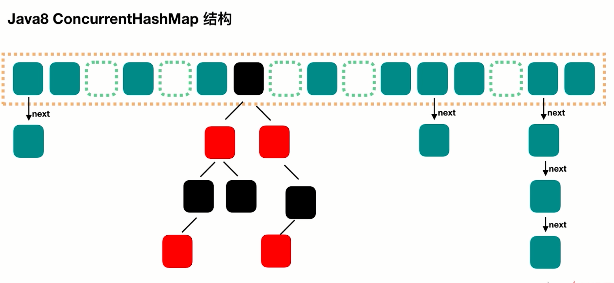


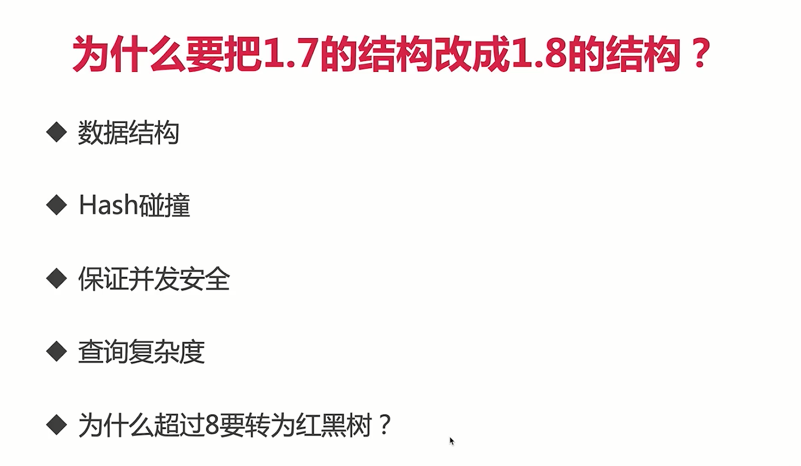

默认是链表的形式因为链表占用的内存更少，

## 9-14 ConcurrentHashMap难道也会发生线程安全问题？：组合操作的玄机

### 演示组合操作出现线程安全问题：

```java
package collections.concurrenthashmap;

import java.util.concurrent.ConcurrentHashMap;

/**
 * 描述：     组合操作并不保证线程安全
 */
public class OptionsNotSafe implements Runnable {

    private static ConcurrentHashMap<String, Integer> scores = new ConcurrentHashMap<String, Integer>();

    public static void main(String[] args) throws InterruptedException {
        scores.put("小明", 0);
        Thread t1 = new Thread(new OptionsNotSafe());
        Thread t2 = new Thread(new OptionsNotSafe());
        t1.start();
        t2.start();
        t1.join();
        t2.join();
        System.out.println(scores);
    }


    @Override
    public void run() {
        for (int i = 0; i < 1000; i++) {
          			Integer score = scores.get("小明");
                Integer newScore = score + 1;
                scores.put("小明",newScore);
        }

    }
}
```

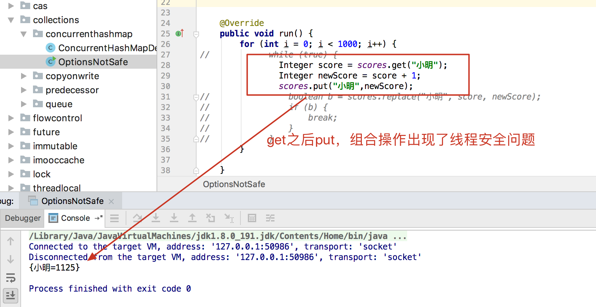

### 使用ConcurrentHashMap的replace()方法解决组合操作线程不安全的问题

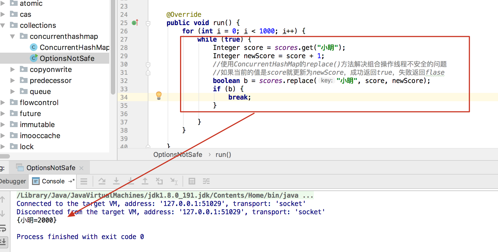

### ConcurrentHashMap的putIfAbsent()方法

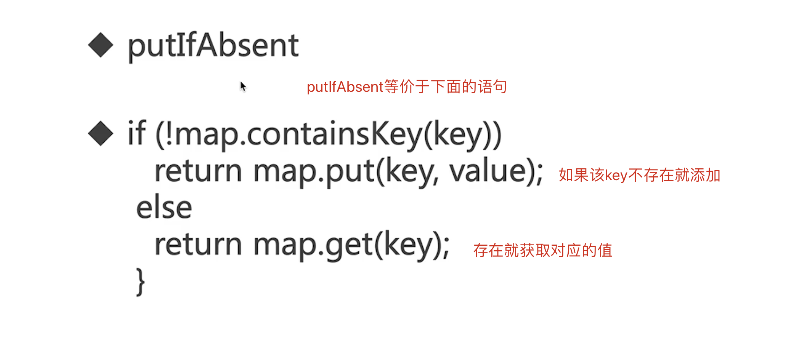

## 9-16 CopyOnWriteArrayList的适用场景、读写规则

```java
package collections.copyonwrite;

import java.util.ArrayList;
import java.util.Iterator;
import java.util.concurrent.CopyOnWriteArrayList;

/**
 * 描述：演示CopyOnWriteArrayList可以在迭代的过程中修改数组内容，但是ArrayList不行，对比
 */
public class CopyOnWriteArrayListDemo1 {

    public static void main(String[] args) {
        ArrayList<String> list = new ArrayList<>();
        //CopyOnWriteArrayList<String> list = new CopyOnWriteArrayList<>();

        list.add("1");
        list.add("2");
        list.add("3");
        list.add("4");
        list.add("5");

        Iterator<String> iterator = list.iterator();

        while (iterator.hasNext()) {
            System.out.println("list is" + list);
            String next = iterator.next();
            System.out.println(next);

            if (next.equals("2")) {
                list.remove("5");
            }
            if (next.equals("3")) {
                list.add("3 found");
            }
        }
    }
}
```

ArrayList在迭代过程中修改数组内容会报错

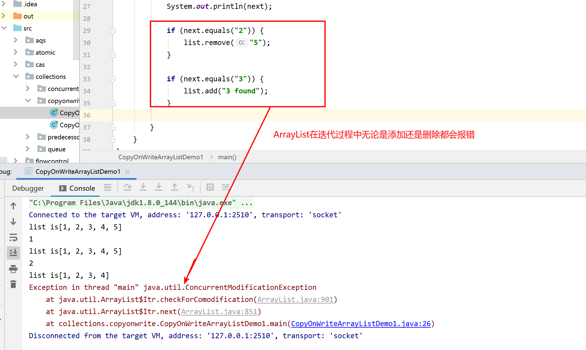

CopyOnWriteArrayList在迭代过程中修改数组内容不会报错

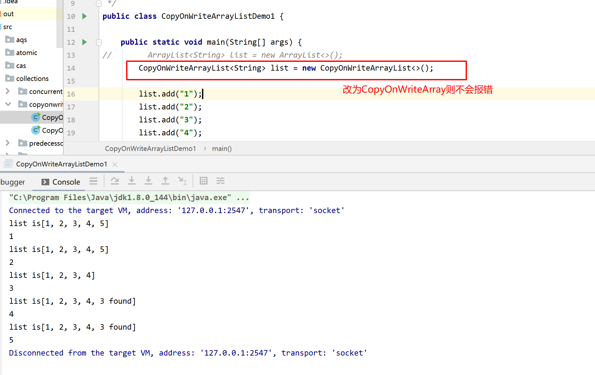

## 9-19 并发队列简介

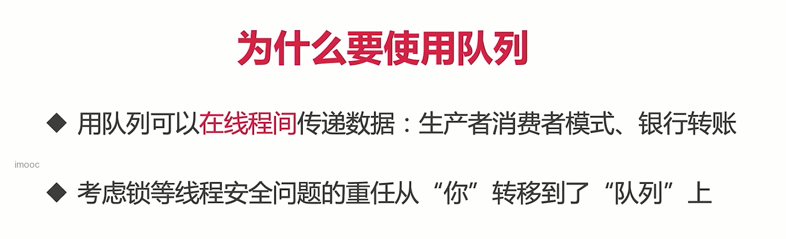

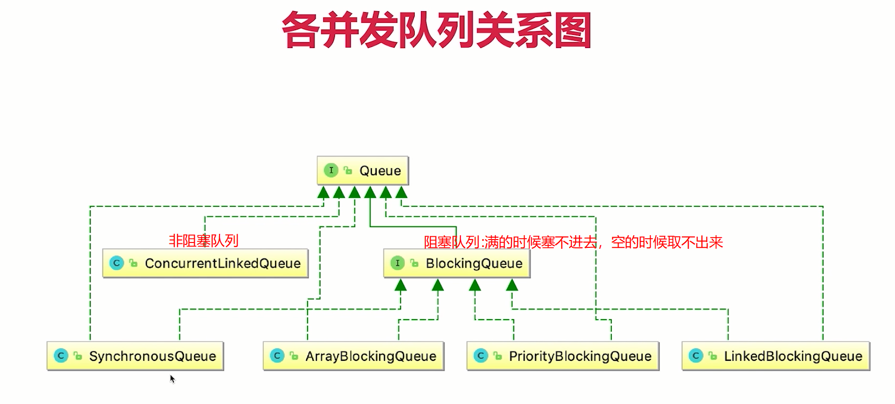

## 9-21 BlockingQueue入门

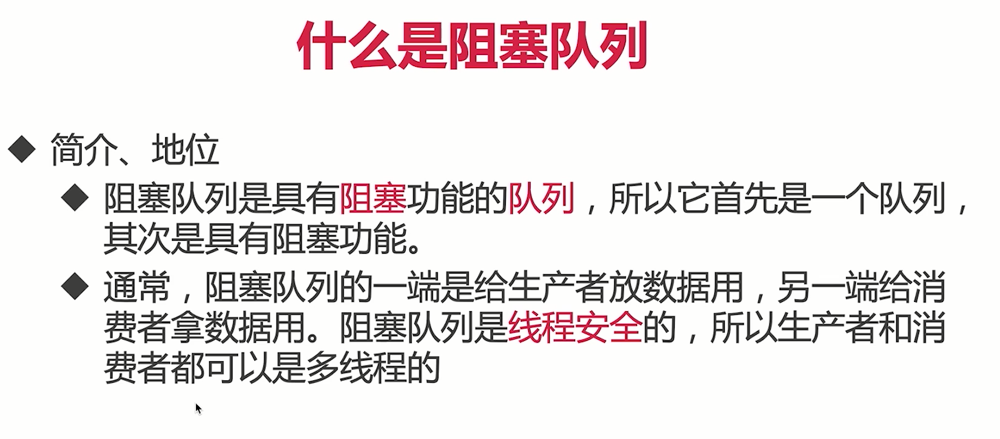


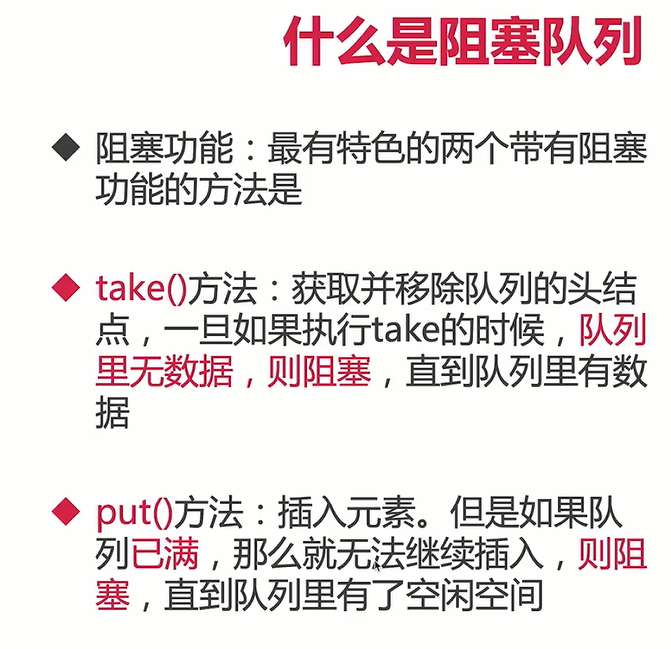


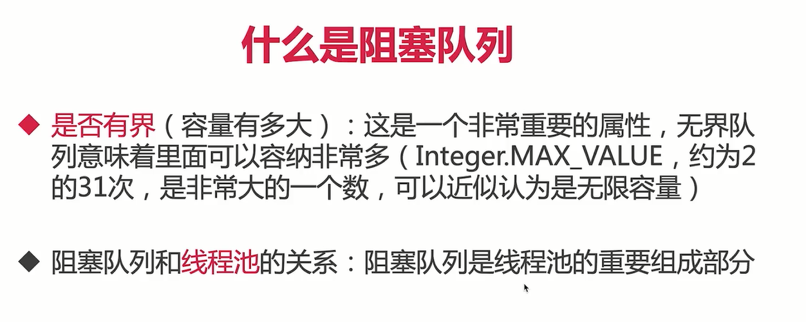

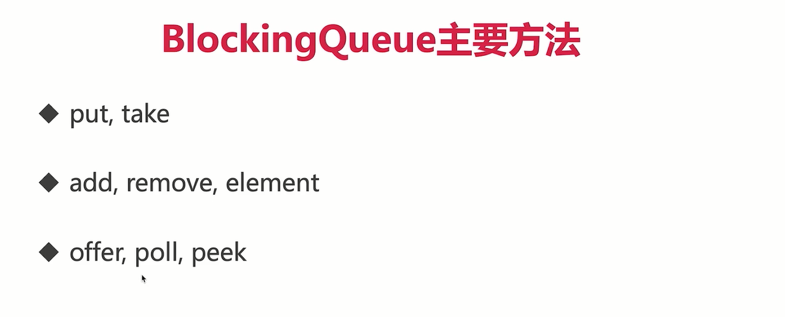

`put`:插入元素。如果队列已满，那么就无法继续插入，就阻塞，直到队列里有了空闲的空间

`take`:获取并移除队列的头节点，如果执行take的时候，队列里无数据，则阻塞，直到队列里有数据


`add`:插入元素。如果队列已满，那么就抛出异常

`remove`删除，如果队列为空删除会抛异常

`element`返回头元素，为空会抛异常


`offer`：插入元素，插入成功返回true，失败返回flase

`poll`取出元素，取出的同时会删除，没有取到返回null

`peek`取出元素，取出的同时不会删除，没有取到返回null

## 9-22 ArrayBlockingQueue代码演示、源码分析

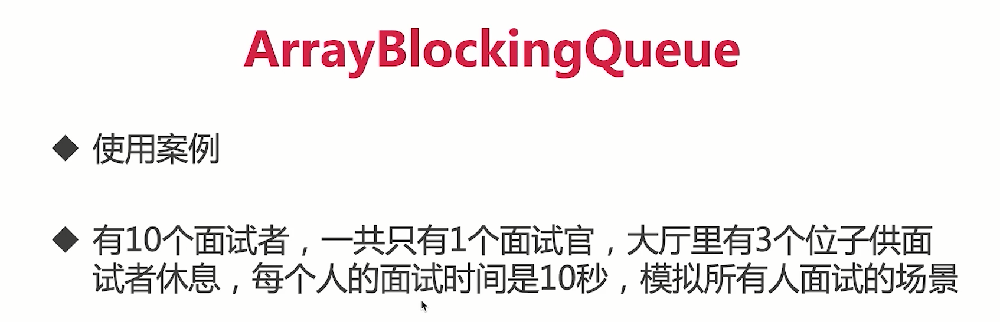

**代码演示：**

```java
package collections.queue;

import java.util.concurrent.ArrayBlockingQueue;
import java.util.concurrent.BlockingQueue;

/**
 * 描述：     TODO
 */
public class ArrayBlockingQueueDemo {


    public static void main(String[] args) {

        ArrayBlockingQueue<String> queue = new ArrayBlockingQueue<String>(3);

        Interviewer r1 = new Interviewer(queue);
        Consumer r2 = new Consumer(queue);
        new Thread(r1).start();
        new Thread(r2).start();
    }
}

class Interviewer implements Runnable {

    BlockingQueue<String> queue;

    public Interviewer(BlockingQueue queue) {
        this.queue = queue;
    }

    @Override
    public void run() {
        System.out.println("10个候选人都来啦");
        for (int i = 0; i < 10; i++) {
            String candidate = "Candidate" + i;
            try {
                //put插入元素。如果队列已满，那么就无法继续插入，就阻塞，直到队列里有了空闲的空间
                queue.put(candidate);
                System.out.println("安排好了" + candidate);
            } catch (InterruptedException e) {
                e.printStackTrace();
            }
        }
        try {
            queue.put("stop");
        } catch (InterruptedException e) {
            e.printStackTrace();
        }
    }
}

class Consumer implements Runnable {

    BlockingQueue<String> queue;

    public Consumer(BlockingQueue queue) {

        this.queue = queue;
    }

    @Override
    public void run() {
        try {
            //模拟面试时间
            Thread.sleep(1000);
        } catch (InterruptedException e) {
            e.printStackTrace();
        }
        String msg;
        try {
            //take获取并移除队列的头节点，如果执行take的时候，队列里无数据，则阻塞，直到队列里有数据
            while(!(msg = queue.take()).equals("stop")){
                System.out.println(msg + "到了");
            }
            System.out.println("所有候选人都结束了");
        } catch (InterruptedException e) {
            e.printStackTrace();
        }
    }
}
```

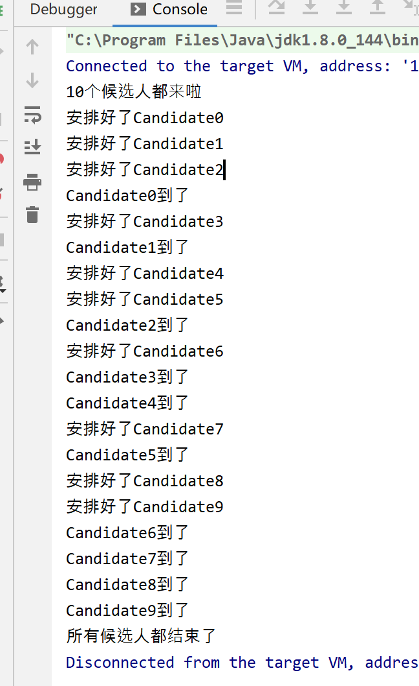


put源码分析：

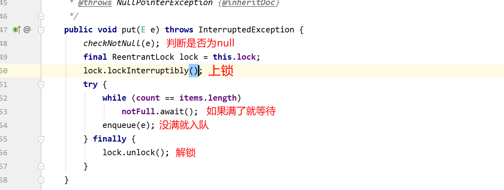