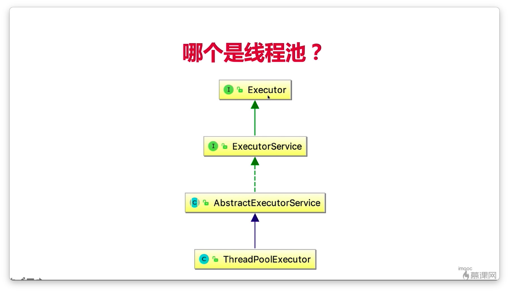

## 3-1 线程池的自我介绍


## 3-2 增减线程的时机


## 3-3 keepAliveTime和线程工厂

### keepAliveTime


### ThreadFactory


### 任务存储队列


直接交接就是不使用队列

## 3-4 演示内存溢出的情况

### 手动创建线程池更好


### 演示newFixedThreadPool（定长线程池）内存溢出的情况 

#### newFixedThreadPool（定长线程池）源码(适用于任务量比较固定但耗时长的任务)

```java
public static ExecutorService newFixedThreadPool(int nThreads) {
    return new ThreadPoolExecutor(nThreads, nThreads,
                                  0L, TimeUnit.MILLISECONDS,
                                  new LinkedBlockingQueue<Runnable>());
}
```


```java
package threadpool;

import java.util.concurrent.ExecutorService;
import java.util.concurrent.Executors;

/**
 * 描述：     演示newFixedThreadPool出错的情况  定长线程池
 */
public class FixedThreadPoolOOM {

    private static ExecutorService executorService = Executors.newFixedThreadPool(1);

    public static void main(String[] args) {
        for (int i = 0; i < Integer.MAX_VALUE; i++) {
            executorService.execute(new SubThread());
        }
    }

}

class SubThread implements Runnable {


    @Override
    public void run() {
        try {
            Thread.sleep(1000000000);
        } catch (InterruptedException e) {
            e.printStackTrace();
        }
    }
}
```

把内存改小方便测出错误


运行一会报错


## 3-5 线程池用法演示

### newSingleThreadExecutor单线程化的线程池:适用于多个任务顺序执行的场景


```java
public static ExecutorService newSingleThreadExecutor() {
    return new FinalizableDelegatedExecutorService
        (new ThreadPoolExecutor(1, 1,
                                0L, TimeUnit.MILLISECONDS,
                                new LinkedBlockingQueue<Runnable>()));
}
```


### newCachedThreadPool可缓存线程池:比较适合任务量大但耗时少的任务


```java
public static ExecutorService newCachedThreadPool() {
    return new ThreadPoolExecutor(0, Integer.MAX_VALUE,
                                  60L, TimeUnit.SECONDS,
                                  new SynchronousQueue<Runnable>());
}
```


### newScheduledThreadPool可调度线程池:适用于执行定时任务和具体固定周期的重复任务

用法：

```java
package threadpool;

import java.util.concurrent.Executors;
import java.util.concurrent.ScheduledExecutorService;
import java.util.concurrent.TimeUnit;

/**
 * 描述：     TODO
 */
public class ScheduledThreadPoolTest {

    public static void main(String[] args) {
        ScheduledExecutorService threadPool = Executors.newScheduledThreadPool(10);
        threadPool.schedule(new Runnable() {
            @Override
            public void run() {
                System.out.println(Thread.currentThread().getName());
            }
        },5,TimeUnit.SECONDS);
        //threadPool.schedule(new Task(), 5, TimeUnit.SECONDS);
        //threadPool.scheduleAtFixedRate(new Task(), 1, 3, TimeUnit.SECONDS);
    }
}
```


用法2：

```java
    public static void main(String[] args) {
        ScheduledExecutorService threadPool = Executors.newScheduledThreadPool(10);
        threadPool.scheduleAtFixedRate(new Runnable() {
            @Override
            public void run() {
                System.out.println(Thread.currentThread().getName());
            }
        }, 1, 3, TimeUnit.SECONDS);

    }
```


### 正确创建线程池的方法


### 线程池里的线程数量设定为多少合适


## 3-6 对比线程池的特点


## 3-7 五虎上将收服线程池

### 1.shutdown:

告诉线程池我想让你停止。使用之后，不会增加新的任务，会把存量的（队列中的）任务执行完毕。

```java
package threadpool;
import java.util.List;
import java.util.concurrent.ExecutorService;
import java.util.concurrent.Executors;
import java.util.concurrent.TimeUnit;
/**
 * 描述：     演示关闭线程池
 */
public class  ShutDown {
    public static void main(String[] args) throws InterruptedException {
        ExecutorService executorService = Executors.newFixedThreadPool(10);
        for (int i = 0; i < 100; i++) {
            executorService.execute(new ShutDownTask());
        }
        Thread.sleep(1500);
        //告诉线程池我想让你停止。使用之后，不会增加新的任务，会把存量的（队列中的）任务执行完毕，
        executorService.shutdown();
        //使用shutdown之后再提交新的任务会报错（用于演示shutdown启作用了）
        executorService.execute(new ShutDownTask());
    }
}
class ShutDownTask implements Runnable {
    @Override
    public void run() {
        try {
            Thread.sleep(500);
            System.out.println(Thread.currentThread().getName());
        } catch (InterruptedException e) {
            System.out.println(Thread.currentThread().getName() + "被中断了");
        }
    }
}
```

### 2.idShutdown

返回布尔值true或false告诉我们线程是否进入停止状态。不是说返回true线程就结束了，而是线程不再接受新的任务（准备结束），但是要继续完成存量的任务，完成后才会结束

```java
package threadpool;

import java.util.List;
import java.util.concurrent.ExecutorService;
import java.util.concurrent.Executors;
import java.util.concurrent.TimeUnit;

/**
 * 描述:演示关闭线程池 idShutdown()
 */
public class  ShutDown {

    public static void main(String[] args) throws InterruptedException {
        ExecutorService executorService = Executors.newFixedThreadPool(10);
        for (int i = 0; i < 100; i++) {
            executorService.execute(new ShutDownTask());
        }
        Thread.sleep(1500);
        //isShutdown()返回布尔值true或false告诉我们线程是否进入停止状态
        System.out.println("isShutdown="+executorService.isShutdown());
        //告诉线程池我想让你停止。使用之后，不会增加新的任务，会把存量的（队列中的）任务执行完毕，
        executorService.shutdown();
        //isShutdown()返回布尔值true或false告诉我们线程是否进入停止状态
        System.out.println("isShutdown="+executorService.isShutdown());
    }
}

class ShutDownTask implements Runnable {
    @Override
    public void run() {
        try {
            Thread.sleep(500);
            System.out.println(Thread.currentThread().getName());
        } catch (InterruptedException e) {
            System.out.println(Thread.currentThread().getName() + "被中断了");
        }
    }
}

```


###  3.isTerminated

isTerminated（）线程完全停止（不再接受新的任务存量任务也执行完毕）会返回true，否则返回false

### 4.awaitTermination

有三种情况会返回：

1.所有线程执行完毕，

2.等待时间到了，

3.等待的过程中被打断了，被中断了

在返回之前是阻塞的。最后根据是否执行完毕返回true或者false

```java
package threadpool;

import java.util.List;
import java.util.concurrent.ExecutorService;
import java.util.concurrent.Executors;
import java.util.concurrent.TimeUnit;

/**
 * 描述：     演示关闭线程池
 */
public class  ShutDown {

    public static void main(String[] args) throws InterruptedException {
        ExecutorService executorService = Executors.newFixedThreadPool(10);
        for (int i = 0; i < 100; i++) {
            executorService.execute(new ShutDownTask());
        }
        Thread.sleep(1500);
        //shutdown()告诉线程池我想让你停止。使用之后，不会增加新的任务，会把存量的（队列中的）任务执行完毕，
        executorService.shutdown();
      	//7秒内线程执行完毕返回true
        boolean b = executorService.awaitTermination(7L, TimeUnit.SECONDS);
        System.out.println(b);
    }
}

class ShutDownTask implements Runnable {
    @Override
    public void run() {
        try {
            Thread.sleep(500);
            System.out.println(Thread.currentThread().getName());
        } catch (InterruptedException e) {
            System.out.println(Thread.currentThread().getName() + "被中断了");
        }
    }
}

```


### 5.shutdownNow

立即停止所有线程，返回未被执行的任务

```
List<Runnable> runnableList = executorService.shutdownNow();
```


```Java
package threadpool;

import java.util.List;
import java.util.concurrent.ExecutorService;
import java.util.concurrent.Executors;
import java.util.concurrent.TimeUnit;
/**
 * 描述：     演示关闭线程池
 */
public class  ShutDown {
    public static void main(String[] args) throws InterruptedException {
        ExecutorService executorService = Executors.newFixedThreadPool(10);
        for (int i = 0; i < 100; i++) {
            executorService.execute(new ShutDownTask());
        }
        Thread.sleep(1500);
      //立即停止所有线程，返回未被执行的任务
       List<Runnable> runnableList = executorService.shutdownNow();
    }
}
class ShutDownTask implements Runnable {
    @Override
    public void run() {
        try {
            Thread.sleep(500);
            System.out.println(Thread.currentThread().getName());
        } catch (InterruptedException e) {
            System.out.println(Thread.currentThread().getName() + "被中断了");
        }
    }
}
```


## 3-8 任务太多怎么拒绝。钩子：给线程池加点料

### 任务太多怎么拒绝


1.AbortPolict直接抛出异常，你没有提交成功

2.DiscardPolicy线程池不能处理任务会默默的把任务丢弃，你不会得到通知

3.DiscardOidestPoslicy会丢弃老的，存在队列中最久的任务会被丢弃

4.CallerRunsPolicy让主线程去运行


```java
package threadpool;

import java.util.concurrent.BlockingQueue;
import java.util.concurrent.LinkedBlockingQueue;
import java.util.concurrent.RejectedExecutionHandler;
import java.util.concurrent.ThreadFactory;
import java.util.concurrent.ThreadPoolExecutor;
import java.util.concurrent.TimeUnit;
import java.util.concurrent.locks.Condition;
import java.util.concurrent.locks.ReentrantLock;

/**
 * 描述：     演示每个任务执行前后放钩子函数
 */
public class PauseableThreadPool extends ThreadPoolExecutor {

    private final ReentrantLock lock = new ReentrantLock();
    private Condition unpaused = lock.newCondition();
    private boolean isPaused;


    public PauseableThreadPool(int corePoolSize, int maximumPoolSize, long keepAliveTime,
            TimeUnit unit,
            BlockingQueue<Runnable> workQueue) {
        super(corePoolSize, maximumPoolSize, keepAliveTime, unit, workQueue);
    }

    public PauseableThreadPool(int corePoolSize, int maximumPoolSize, long keepAliveTime,
            TimeUnit unit, BlockingQueue<Runnable> workQueue,
            ThreadFactory threadFactory) {
        super(corePoolSize, maximumPoolSize, keepAliveTime, unit, workQueue, threadFactory);
    }

    public PauseableThreadPool(int corePoolSize, int maximumPoolSize, long keepAliveTime,
            TimeUnit unit, BlockingQueue<Runnable> workQueue,
            RejectedExecutionHandler handler) {
        super(corePoolSize, maximumPoolSize, keepAliveTime, unit, workQueue, handler);
    }

    public PauseableThreadPool(int corePoolSize, int maximumPoolSize, long keepAliveTime,
            TimeUnit unit, BlockingQueue<Runnable> workQueue,
            ThreadFactory threadFactory, RejectedExecutionHandler handler) {
        super(corePoolSize, maximumPoolSize, keepAliveTime, unit, workQueue, threadFactory,
                handler);
    }

    @Override
    protected void beforeExecute(Thread t, Runnable r) {
        super.beforeExecute(t, r);
        lock.lock();
        try {
            while (isPaused) {
                unpaused.await();
            }
        } catch (InterruptedException e) {
            e.printStackTrace();
        } finally {
            lock.unlock();
        }
    }

    private void pause() {
        lock.lock();
        try {
            isPaused = true;
        } finally {
            lock.unlock();
        }
    }

    public void resume() {
        lock.lock();
        try {
            isPaused = false;
            unpaused.signalAll();
        } finally {
            lock.unlock();
        }
    }

    public static void main(String[] args) throws InterruptedException {
        PauseableThreadPool pauseableThreadPool = new PauseableThreadPool(10, 20, 10l,
                TimeUnit.SECONDS, new LinkedBlockingQueue<>());
        Runnable runnable = new Runnable() {
            @Override
            public void run() {
                System.out.println("我被执行");
                try {
                    Thread.sleep(10);
                } catch (InterruptedException e) {
                    e.printStackTrace();
                }
            }
        };
        for (int i = 0; i < 10000; i++) {
            pauseableThreadPool.execute(runnable);
        }
        Thread.sleep(1500);
        pauseableThreadPool.pause();
        System.out.println("线程池被暂停了");
        Thread.sleep(1500);
        pauseableThreadPool.resume();
        System.out.println("线程池被恢复了");

    }
}
```

## 3-9 Executor家族的辨析(实现原理、源码分析)





## 3-10 线程池状态和使用注意点


